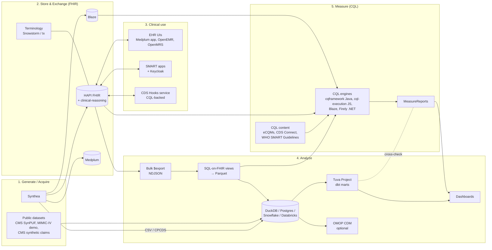

# Kindling: Vision and Plan

## 1. The problem

A healthcare organization that wants to "adopt FHIR", "go digital with quality measures"
or "stand up a modern analytics stack" faces a long list of open-source parts and very
little guidance on putting them together:

- **Specs pile up.** FHIR R4, US Core, QI-Core, DEQM, Bulk Data, SMART App Launch,
  CDS Hooks, SQL on FHIR, CQL/ELM, CARIN BB, Da Vinci. Each is readable on its own, but
  none explains how it relates to the others.
- **Tools are built in isolation.** Synthea output doesn't load cleanly into every FHIR
  server. Tuva expects a claims/clinical input layer, not FHIR. CQL engines differ in
  which data sources they can read. Most "open-source EHRs" keep their own database and
  expose FHIR as a facade.
- **The plumbing is hidden.** Value set expansion, terminology licensing (UMLS, SNOMED,
  CPT), measure packaging, ELM translation, bulk export and the order in which bundles
  must be loaded are where teams lose weeks. None of it is documented in one place.
- **Nobody tests the combination.** Each project tests itself. No one tests
  "Synthea vX → HAPI vY → Tuva vZ → CMS165 via clinical-reasoning vW" as a whole.

**Kindling's job is to own the seams.** It explains them, automates them, tests them
and runs them in public.

## 2. Who it's for

| Persona | What they need from Kindling |
|---|---|
| **Health system / payer data team** | A clear path from source data to FHIR to analytics marts and quality measures, and evidence that it works on their warehouse. |
| **Quality / informatics team** | A way to run and debug eCQMs and CDS content locally, see *why* a patient is in or out of a population, and compare against SQL implementations. |
| **Interop / platform engineers** | A reference topology: which FHIR server, how to load it, how to secure it with SMART, how to bulk export. |
| **Digital health startups** | A realistic sandbox (EHR + FHIR + SMART + CDS Hooks) to build and demo against. |
| **Educators and students** | A place to click around and see the whole ecosystem working. |

Start with the first two. They have the most pain and the least open-source help.

## 3. The whole story (target architecture)



The story Kindling tells, in order:

1. **Generate** realistic patients (Synthea) and pull in public claims datasets.
2. **Store** them in a FHIR server, validated against US Core, with terminology services.
3. **Use** them clinically: an EHR UI, SMART apps launched against the same server, and
   CDS Hooks cards driven by CQL.
4. **Analyze** them: bulk export, flatten with SQL-on-FHIR ViewDefinitions, land in a
   warehouse, run Tuva to get claims, clinical, HCC, PMPM, readmissions and
   quality-measure marts.
5. **Measure** them: run eCQMs written in CQL on several engines, produce
   MeasureReports, and **cross-check** the results against Tuva's SQL implementation of
   the same measures. When the two disagree, the reason teaches you something about the
   measure, the data or the engine.

Point 5 is Kindling's signature feature. No one else shows the same measure computed two
independent ways on the same data with the differences explained.

## 4. What we build

### 4.1 Guides (`docs/`)

Built with MkDocs Material, published to GitHub Pages. Four kinds of content:

- **Concepts:** FHIR in one page, profiles and IGs, terminology and licensing, what CQL
  and ELM are, how a Measure resource works, SQL on FHIR, what Tuva's input layer is.
- **Walkthroughs:** end-to-end and runnable, each ending in a working result:
  1. *Zero to dashboard*: Synthea → HAPI → Bulk export → DuckDB → Tuva → dashboard.
  2. *Your first eCQM*: load CMS165 (Controlling High Blood Pressure) content, evaluate it,
     read the MeasureReport, trace one patient's inclusion.
  3. *One measure, two ways*: CQL vs. Tuva SQL, with the diff explained.
  4. *SMART on FHIR in an afternoon*: Keycloak, launch context, a sample app.
  5. *CDS Hooks with CQL*: a `patient-view` hook returning cards from CQL logic.
  6. *Bring your own warehouse*: the same pipeline on Postgres, Snowflake or Databricks.
- **Landscape:** a catalog of every tool with its role, license, maturity, how it connects
  to its neighbors and known sharp edges. Generated from `catalog/*.yaml`.
- **Decisions (ADRs):** why the golden path chose HAPI over X, DuckDB over Y, and so on.

### 4.2 Reference stack (`stack/`)

Docker Compose with **profiles**, so people start only what they need:

| Profile | Services | Approx. RAM |
|---|---|---|
| `core` | HAPI FHIR (Postgres), data loader job | 3 GB |
| `analytics` | + DuckDB/Postgres, dbt + Tuva, Evidence/Superset | 5 GB |
| `quality` | + clinical-reasoning (in HAPI), Blaze, CQL runner, VS Code CQL dev container | 6 GB |
| `clinical` | + Medplum (server + app), Keycloak (SMART), SMART launcher, CDS Hooks service | 8 GB |
| `ehr-legacy` | + OpenEMR and/or OpenMRS with FHIR facades | +3 GB |
| `full` | everything | 16 GB+ |

A single entry point:

```bash
pipx install kindling-health
kindling up --profile analytics --patients 1000
kindling open dashboards
```

Every image is pinned by digest. A `stack/matrix.yaml` file lists the certified version
combinations, and nightly CI runs the full set of walkthroughs against each one.

### 4.3 Python glue libraries (`packages/`, published to PyPI)

A `uv` workspace publishing independent packages under the `kindling-` prefix. `kindling`
itself is taken on PyPI; `kindling-health`, `kindling-cql` and `kindling-fhir` were free
at the time of writing and should be reserved early. Each package does one job and has no
stack dependency, so enterprises can use them without the rest of Kindling.

| Package | Job |
|---|---|
| `kindling-health` | CLI and orchestrator (`kindling up/load/run/open`), a thin umbrella. |
| `kindling-synthea` | Run Synthea reproducibly (seeded, pinned JAR, config presets for population, modules, claims exporters) from Python. |
| `kindling-fhir-load` | Load bundles into *any* FHIR server correctly: dependency ordering (practitioner/org bundles first), transaction vs. batch, reference rewriting, retries, `$import` where supported, progress reporting. |
| `kindling-bulk` | Bulk Data `$export` client (kick-off, polling, auth) → NDJSON → Parquet. |
| `kindling-sof` | SQL-on-FHIR v2 ViewDefinition runner targeting DuckDB (and other SQL engines), plus a library of views that produce **Tuva input-layer tables** from FHIR. Evaluate and reuse existing work (Tuva's FHIR connectors, Pathling, Google FHIR Data Pipes) before building. |
| `kindling-cql` | **One API over many CQL engines.** See below. |
| `kindling-content` | Fetch, pin and package CQL/measure content from upstream repos; expand value sets through VSAC using the *user's* UMLS key; build FHIR NPM packages; never redistribute restricted content. |
| `kindling-terminology` | Helpers for loading code systems and value sets into a terminology server, with licensing checks built in. |

#### `kindling-cql` in more detail

The CQL world has good engines, but each has its own data-access plumbing and its own
way of being invoked. `kindling-cql` hides that behind one interface:

```python
from kindling_cql import Measure, backends

m = Measure.from_package("ecqm-content-qicore-2025", "CMS165")
report = m.evaluate(
    backend=backends.FhirServer("http://localhost:8080/fhir"),   # $evaluate-measure
    period=("2025-01-01", "2025-12-31"),
)
report.populations            # counts by population
report.explain("patient-123") # which criteria were met, with the evaluated expressions
```

Planned backends:

| Backend | Mechanism |
|---|---|
| `FhirServer` | Remote `$evaluate-measure` / `Library/$evaluate` (HAPI clinical-reasoning, Blaze, others that implement DEQM operations). |
| `JavaEngine` | Embedded cqframework engine (via a managed JVM subprocess or a small bundled service) reading NDJSON/Parquet files directly. No server needed. |
| `JsEngine` | `cql-execution` + `cql-exec-fhir` (or MITRE's `fqm-execution`) in a managed Node subprocess. |
| `Sql` (research) | CQL → SQL over SQL-on-FHIR views, so measures can run *in the warehouse*. This is the long-term target for enterprises with large populations; start with a restricted subset of CQL. |

Around the backends: **an engine parity harness** runs every measure in the content set on
every backend against the same fixture data (including the measures' own test cases) and
publishes a parity table. This helps the whole ecosystem, and upstream engine maintainers
get bug reports with minimal reproductions.

### 4.4 Content (`content/`)

**Manifests, not copies.** YAML files that point at upstream sources with pinned
revisions:

- CMS eCQMs (QI-Core/FHIR versions from the eCQI Resource Center and cqframework
  `ecqm-content-*` repositories).
- AHRQ CDS Connect artifacts.
- WHO SMART Guidelines (DAK CQL, e.g. immunizations and antenatal care).
- CDC opioid prescribing CDS.
- Community measures in the Tuva/OHDSI world, where CQL versions exist.

Each entry records the license, FHIR version, required value sets and whether VSAC access
is needed. We also add Kindling-authored **test fixtures**: small Synthea cohorts tuned so
that every population of a measure has patients in it.

### 4.5 Hosted reference implementation (`deploy/`)

A public demo at something like `demo.kindling.health`:

- **Read-only public tier:** FHIR API (rate-limited), dashboards, a measure-results
  explorer, and the EHR UI with shared demo logins.
- **Sandbox tier:** a per-user ephemeral stack, reset every 24h, for trying writes, SMART
  launches and CDS Hooks.
- **Nightly rebuild** from `main` with fresh synthetic data. This doubles as the largest
  integration test.
- Start with a single mid-size VM running Compose (cheap, simple), and move to k8s with
  Helm charts once the sandbox tier needs per-user isolation.
- Synthetic data only, with a visible banner saying so. Rate limits and WAF in front. No
  user-uploaded data.

## 5. Roadmap

Rough durations assume one to two core contributors. Each phase ends with something a
person can use.

### Phase 0: Foundations (weeks 1–3)
- Repo layout, Apache-2.0 license, CONTRIBUTING, code of conduct, ADR template.
- MkDocs site skeleton published to Pages.
- `catalog/` YAML schema, with the first 30 tools filled in → generated landscape page.
- `uv` workspace, CI (lint, type-check, tests), PyPI name reservations, trusted publishing.
- Terminology and licensing explainer. Write this first; it's the most common blocker.

**Exit:** the site is live, the landscape page is published and packages are publishable.

### Phase 1: "Zero to dashboard" MVP (weeks 3–8)
- `stack/` `core` + `analytics` profiles.
- `kindling-synthea`, `kindling-fhir-load`, `kindling-bulk` v0.1.
- FHIR → Tuva input layer path (via `kindling-sof` or an existing Tuva connector, per ADR).
- Tuva running on DuckDB, with a small Evidence (or Superset) dashboard.
- Walkthrough #1 and a nightly CI job that runs it end-to-end.

**Exit:** a new user gets from `git clone` to a Tuva dashboard of 1,000 synthetic
patients in under 30 minutes on a laptop.

### Phase 2: Quality measures and CQL (weeks 8–14)
- `quality` profile: HAPI clinical-reasoning plus Blaze.
- `kindling-content` pulling a starter set of about 5 eCQMs (e.g. CMS165, CMS122,
  CMS125, CMS130, CMS69) with VSAC expansion via the user's UMLS key.
- `kindling-cql` v0.1 with the `FhirServer` and `JavaEngine` backends.
- Parity harness v1, with the parity table published on the site.
- Walkthroughs #2 and #3 (CQL vs. Tuva SQL cross-check).
- CQL authoring dev container (VS Code CQL extension, translator, test runner).

**Exit:** a quality analyst can run and explain a CMS eCQM locally, and can see where CQL
and SQL agree and why they differ.

### Phase 3: Clinical and apps (weeks 14–20)
- `clinical` profile: Medplum, Keycloak with SMART, a SMART launcher, sample SMART apps.
- CDS Hooks service backed by `kindling-cql` (reusing CDS Connect content).
- `ehr-legacy` profile with OpenEMR/OpenMRS, and a guide on "FHIR-native vs. FHIR-facade
  EHRs" covering how to get Synthea data into each (e.g. via C-CDA import).
- Inferno test runs against the stack, published as a conformance snapshot.
- Walkthroughs #4 and #5.

### Phase 4: Hosted reference (starts in parallel at about week 10; public by week 20)
- Single-VM deployment of `full`, nightly rebuild, monitoring, banner, rate limits.
- Measure-results explorer UI (MeasureReports + per-patient explanations).
- Later: sandbox tier on k8s.

### Phase 5: Enterprise adoption (week 20+)
- Walkthrough #6: warehouse adapters (Postgres, Snowflake, Databricks, BigQuery).
- `kindling-cql` `JsEngine` backend, and the research `Sql` backend.
- OMOP bridge guide (FHIR ↔ OMOP, Tuva ↔ OMOP) for OHDSI shops.
- Payer track: CARIN BB, claims data (CMS synthetic claims, SynPUF) → Tuva, and the
  Da Vinci IGs worth knowing.
- Helm charts and hardening guides (auth, audit, backups).
- "Adoption playbooks": a 30/60/90-day plan for a health system adopting dQMs.

## 6. Repository layout (target)

```
kindling/
├── README.md
├── docs/                 # MkDocs site: concepts, walkthroughs, landscape, ADRs
│   ├── PLAN.md
│   ├── landscape.md
│   └── decisions/
├── catalog/              # one YAML per upstream tool → generates landscape pages
├── stack/                # docker compose profiles, configs, matrix.yaml
├── packages/             # uv workspace of kindling-* PyPI packages
│   ├── kindling-health/
│   ├── kindling-synthea/
│   ├── kindling-fhir-load/
│   ├── kindling-bulk/
│   ├── kindling-sof/
│   ├── kindling-cql/
│   └── kindling-content/
├── content/              # manifests pointing at upstream CQL/measure content + fixtures
├── dbt/                  # dbt project wiring Tuva to Kindling's input layer
├── deploy/               # hosted reference: terraform, helm, runbooks
└── tests/integration/    # walkthrough-as-test suites run nightly per matrix entry
```

## 7. Engineering practices

- **Walkthroughs are tests.** Every guide has a matching integration test. If a doc's
  commands stop working, CI goes red.
- **Compatibility matrix.** Renovate bumps upstream versions, and a combination is
  certified only after the nightly suite passes on it. Every entry records the date it
  was last verified.
- **Upstream first.** Bugs found in engines, servers or Tuva go upstream with a minimal
  repro; Kindling carries a documented workaround only until the fix is released.
- **Deterministic data.** Synthea runs are seeded, so results (measure counts, dashboard
  numbers) are reproducible and can be asserted on in tests.

## 8. Risks and mitigations

| Risk | Mitigation |
|---|---|
| **Upstream churn** (e.g. cqf-ruler folded into HAPI clinical-reasoning; NextGen Connect moved to a closed license) | Pinned matrix, nightly tests, ADRs that record *why*, and a catalog "status" field so the docs warn users. |
| **Terminology licensing** (CPT, SNOMED, VSAC terms) | Never redistribute restricted content. Fetch with the user's credentials. Synthea's code subset works for demos. Document plainly what's required. |
| **Resource footprint** (several JVMs) | Profiles; publish RAM numbers; a `lite` path using Blaze + DuckDB. |
| **Public demo abuse or cost** | Read-only public tier, rate limits, nightly wipe, budget alerts, sandbox tier behind sign-in. |
| **Correctness claims** | State plainly that Kindling is *not* a certified measure calculator. The parity table shows agreement, not certification. |
| **Scope creep** | Personas and phases gate the work; the landscape catalog can list a tool without Kindling integrating it. |
| **Maintainer bandwidth** | Each package is small and independent; build a contributor path through catalog entries and walkthrough fixes; seek sponsorship (see below). |

## 9. Community and sustainability

- Build in the open; publish the roadmap as GitHub Projects milestones for each phase.
- Engage upstream communities early: Synthea, Tuva, cqframework/HL7 CQI, HAPI, Medplum,
  OHDSI and SQL on FHIR. Kindling should feel like a friend to these projects, not a fork.
- Show up where the audience already is: HL7 Connectathons (the Clinical Reasoning and
  DEQM tracks are natural fits), chat.fhir.org, the Tuva community Slack, and OHDSI
  working groups.
- Possible funding: sponsorships from vendors who benefit, foundation grants for
  interoperability and open health, and paid enterprise support or hosting later if
  there's demand.

## 10. Success metrics

- Time to first dashboard: **< 30 min** on a 16 GB laptop.
- Walkthroughs green nightly on **≥ 3** certified matrix combinations.
- Engine parity table covering **≥ 10** eCQMs across **≥ 3** engines.
- Monthly PyPI downloads, contributors from outside the core team, and adoption case
  studies from health systems or payers.

## 11. Open decisions

1. **Primary persona:** analytics/quality teams (recommended) vs. interop/app developers.
2. **Golden-path FHIR server:** HAPI (recommended: broadest adoption, and
   clinical-reasoning is built in) vs. Blaze (lighter, fast CQL) vs. Medplum (also the EHR).
3. **Dashboard layer:** Evidence (code-first, fits dbt) vs. Superset (familiar BI).
4. **Hosting budget and domain** for the public reference implementation.
5. **Governance:** a personal/consultancy project for now, or a neutral org from day one.

## 12. Next steps (the first two weeks)

1. Decide on the open questions above, and record each decision as an ADR.
2. Reserve the PyPI names and set up the `uv` workspace with trusted publishing.
3. Write the catalog schema and fill in the first 30 tools.
4. Spike: Synthea (seeded, 1k patients) → HAPI → `$export` → DuckDB, and time it.
5. Spike: CMS165 on HAPI clinical-reasoning vs. Tuva's quality measures mart on the same
   data, and write up the first diff.
6. Publish the docs site with the vision, the landscape and the licensing explainer.
