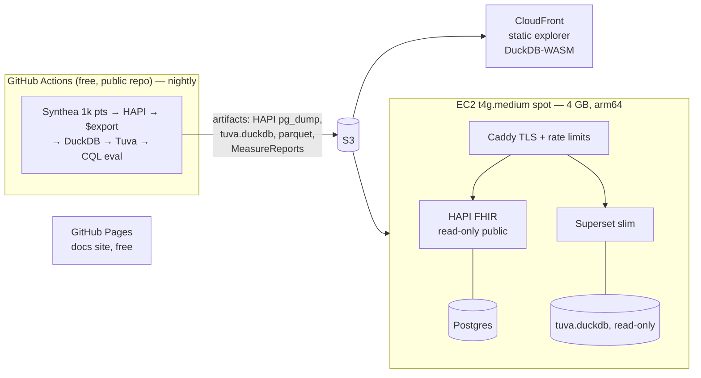

# 0004: Host the reference implementation on AWS for $10–20/month

**Status:** Accepted (2026-09-25). The AWS account will be provided when Phase 4 starts.

## Context
The public reference implementation must cost **no more than $10–20/month** on AWS.
The full local stack (`full` profile) needs 16 GB+ of RAM, so it can't run live within
that budget. An on-demand 16 GB instance alone costs more than $100/month. Common AWS
building blocks are also ruled out on cost:

| Service | Approx. monthly cost | Verdict |
|---|---|---|
| Application Load Balancer | ~$16+ | ✗ Use Caddy on the instance for TLS |
| NAT Gateway | ~$32+ | ✗ Public subnet only |
| EKS control plane | ~$73 | ✗ Plain Docker Compose |
| RDS (smallest) | ~$12+ | ✗ Postgres in a container |

## Decision
**Compute in CI, serve cheaply.** The expensive work runs for free in GitHub Actions,
and AWS only *serves* the results.

### Tiers
1. **Static tier (≈ $0):** the docs site on GitHub Pages. A measure-results explorer and
   an in-browser SQL console (DuckDB-WASM over Parquet) served from S3 + CloudFront,
   within the always-free CloudFront allowance.
2. **Live tier (one small box):** HAPI FHIR (public read-only; Caddy allows only
   `GET` plus single-patient `$evaluate-measure`), Superset (slim, per ADR 0003) and
   Postgres, all on one **t4g.medium spot instance** with a 2 GB swap file. The instance
   is stateless. On boot and nightly it pulls the latest artifacts from S3 and restores
   them (`pg_restore` is much faster than reloading bundles).
3. **"Sandbox" tier (≈ $0 to us):** instead of hosted per-user sandboxes, a devcontainer
   configuration lets anyone start the full stack in their own GitHub Codespace or on
   their own laptop.

### Estimated monthly cost (us-east-1, approximate; re-verify at deploy time)

| Item | Estimate |
|---|---|
| t4g.medium spot (~$0.010–0.014/hr) | $8–10 |
| Public IPv4 address ($0.005/hr) | $3.65 |
| EBS gp3 20 GB | $1.60 |
| S3 + CloudFront (small artifacts, free-tier egress) | < $1 |
| Route 53 hosted zone | $0.50 |
| **Total** | **≈ $14–16** |

Guardrails: an AWS Budgets alert at $15 (warning) and $20 (critical); infrastructure as
code with OpenTofu, with state in S3; nothing gets created by hand in the console.

## Consequences
- **Blaze, Medplum, Keycloak/SMART, OpenEMR and OpenMRS are not hosted live.** They run
  locally or in Codespaces, and the docs show them with recorded walkthroughs.
- **Population stays small** (about 1,000 patients) so HAPI and Postgres fit in 4 GB.
  HAPI heap is capped at about 1.5 GB.
- **Full-population measure evaluation is precomputed in CI.** Live CQL runs only for a
  single patient, with strict rate limits.
- **Spot interruptions cause brief downtime.** An Auto Scaling group of size 1
  re-launches the instance, and because it's stateless it recovers on its own. That's an
  acceptable trade for a demo.
- **Everything must run on arm64 (Graviton).** Where an image lacks arm64, fall back to
  t3a.medium spot at a similar price.
- **Domain:** use a subdomain of a domain we already own (e.g. `kindling.<existing
  LaRocca Consulting domain>`) to avoid new registration fees. `.health` domains are
  expensive.
- If spot capacity or prices ever push costs over budget, the fallback is a scheduled
  stop overnight (the static tier stays up), not a bigger bill.
- **Upgrade path if the budget grows:** t4g.large spot (8 GB, about $15–20) would allow
  hosting Blaze for live engine parity.
