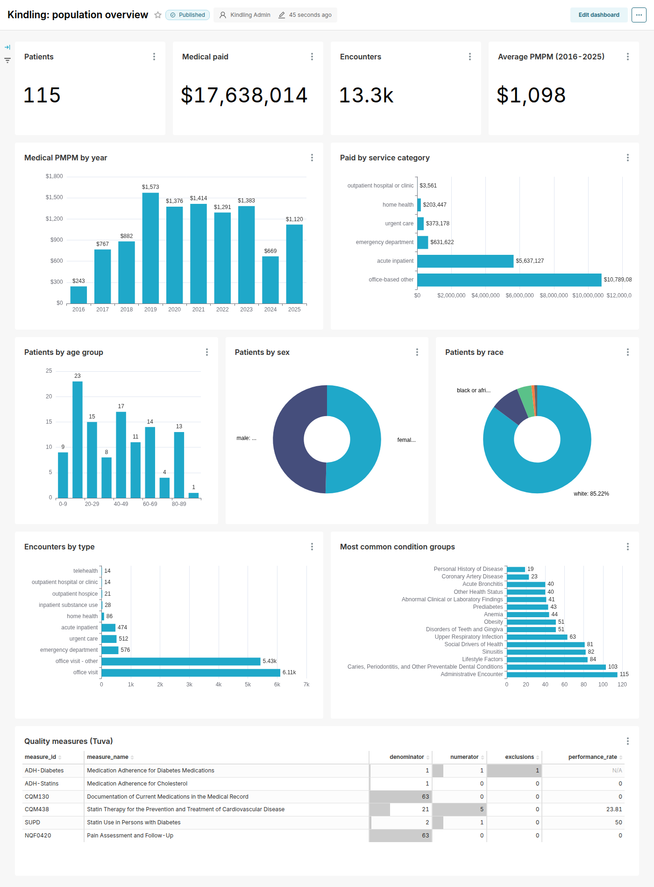

# Zero to dashboard

This walkthrough runs Kindling's whole analytics path on your machine:

1. **Generate** synthetic patients with Synthea.
2. **Load** them into a HAPI FHIR server.
3. **Export** everything back out with the FHIR Bulk Data API.
4. **Flatten** the NDJSON into DuckDB tables with SQL on FHIR views.
5. **Transform** those tables into Tuva's input layer and run Tuva (dbt), including the
   Quality Measures package.
6. **Explore** the results in Superset.

It's the same sequence CI runs on every change (`.github/workflows/pipeline.yml`), so
if these commands stop working, the build goes red.

## Prerequisites

- Docker with Compose v2, and ~6 GB of free RAM
- Java 17+ (Synthea runs on the JVM)
- [uv](https://docs.astral.sh/uv/) (Python package manager)

## 1. Get the code and start HAPI FHIR

```bash
git clone https://github.com/laroccaconsulting/kindling
cd kindling
uv sync --group dbt
uv run kindling up --profile core      # HAPI FHIR + Postgres on http://localhost:8080
```

HAPI takes a minute to boot. `http://localhost:8080/fhir/metadata` answers when it's
ready (the pipeline waits for it automatically).

## 2. Run the pipeline

```bash
uv run kindling run --patients 100
```

Each step prints what it did:

| Step | What happens | Time for 100 patients* |
|---|---|---|
| `generate` | Synthea (pinned v3.4.0, seed 42) writes one transaction bundle per patient | ~40 s |
| `load` | Provider bundles first, then patients 4 at a time | ~3½ min |
| `export` | `$export` → one NDJSON file per resource type and batch | ~2 min |
| `flatten` | 19 SQL on FHIR views → `fhir.*` tables in `.kindling/warehouse/kindling.duckdb` | ~20 s |
| `tuva-assets` | Mirrors Tuva's terminology (~230 MB, once) | ~40 s first time |
| `transform` | `dbt deps` + `dbt build`: connector → Tuva Core → Quality Measures (536 models, seeds and tests) | ~3–5 min |

\* Measured on a 4-core, 16 GB machine (115 patients including the deceased, ~125,000 FHIR resources). Load time scales roughly linearly with patients: 1,000 patients
takes ~30 minutes to load.

You can run any step on its own (`uv run kindling export`) or a subset
(`uv run kindling run flatten transform`). Settings: `--patients`, `--seed`, `--state`,
`--fhir-url`. Pointing `--fhir-url` at a different FHIR server works too, as long as it
supports transactions and Bulk Data export.

## 3. Look at the results

The warehouse is a single DuckDB file:

```bash
uv run python -c "
import duckdb
con = duckdb.connect('.kindling/warehouse/kindling.duckdb', read_only=True)
print(con.sql('select * from quality_measures.summary_counts'))
print(con.sql('select service_category_2, count(*), round(sum(paid_amount)) from core.medical_claim group by 1 order by 3 desc'))
"
```

Schemas to explore:

| Schema | Contents |
|---|---|
| `fhir` | The flattened FHIR resources (one table per ViewDefinition) |
| `input_layer` | Kindling's mapping into Tuva's input contract |
| `core` | Tuva's core data model: patients, encounters, claims, conditions, … |
| `quality_measures` | Measure results by patient and summary counts |

## 4. Dashboards (Superset)

```bash
uv run kindling up --profile analytics   # adds Superset on http://localhost:8088 (admin/admin)
```

Superset connects to the DuckDB warehouse read-only and imports the **Kindling: population
overview** dashboard on startup:



Dashboards are code: `superset/build_assets.py` defines the datasets, charts and layout and
writes an import bundle to `superset/assets/`. Edit it, rerun it, and rebuild the image
(`docker compose -f stack/compose.yaml --profile analytics up -d --build`).

## Clean up

```bash
uv run kindling down --volumes   # stop containers and delete the FHIR database
rm -rf .kindling                 # generated data and the warehouse
```

## What just happened (and what was glued)

Most of the work in this walkthrough is done by upstream projects. Kindling's part is
the seams:

- **Load order.** Synthea patient bundles reference practitioners and organizations by
  *conditional reference*, so provider bundles must load first (`kindling-fhir-load`).
- **Flattening.** Standard SQL on FHIR views rather than bespoke scripts, so the same
  definitions work on other engines (`kindling-sof`).
- **Terminology.** Tuva normally reads its terminology from S3 on every `dbt seed`;
  Kindling mirrors it once and points Tuva at the local copy.
- **Synthea → Tuva.** SNOMED → ICD-10-CM, RxNorm → NDC, derived settings, bill types and
  enrollment. Every assumption is listed in
  [From Synthea FHIR to Tuva](../concepts/synthea-to-tuva.md).
