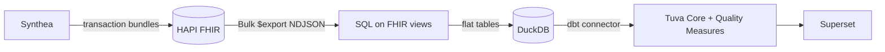

# Kindling

**Open-source healthcare tools, wired together.**

Synthea, HAPI FHIR, SQL on FHIR, the Tuva Project, CQL engines: each is excellent on its
own. Kindling tells the whole story of how they fit together, and ships the glue that
makes them work as one system:

## Start here

- **[Zero to dashboard](guides/zero-to-dashboard.md).** Run the whole pipeline on your laptop:
  synthetic patients in a FHIR server, flattened with SQL on FHIR, modeled by Tuva.
- **[From Synthea FHIR to Tuva](concepts/synthea-to-tuva.md).** Every gap between
  synthetic FHIR and billing-grade claims, and how Kindling bridges it.
- **[Landscape](landscape.md).** The tools, what they do and how they connect.
- **[Vision & plan](PLAN.md).** Where this is going, with the decisions behind it in
  [ADRs](decisions/README.md).

## The pieces Kindling ships

| Package | What it does |
|---|---|
| `kindling-synthea` | Run a pinned Synthea release reproducibly from Python |
| `kindling-fhir-load` | Load bundles into any FHIR server in dependency order, with retries |
| `kindling-bulk` | FHIR Bulk Data `$export` client → NDJSON |
| `kindling-sof` | SQL on FHIR v2 engine → DuckDB/Parquet (passes the full conformance suite) |
| `kindling-health` | The `kindling` CLI that runs it all, plus a Tuva terminology mirror |
| `dbt/` | A Tuva connector that maps flattened FHIR to Tuva's input layer |

!!! note "Synthetic data only"
    Kindling never handles real patient data: not in this repository, CI or the hosted
    demo.
